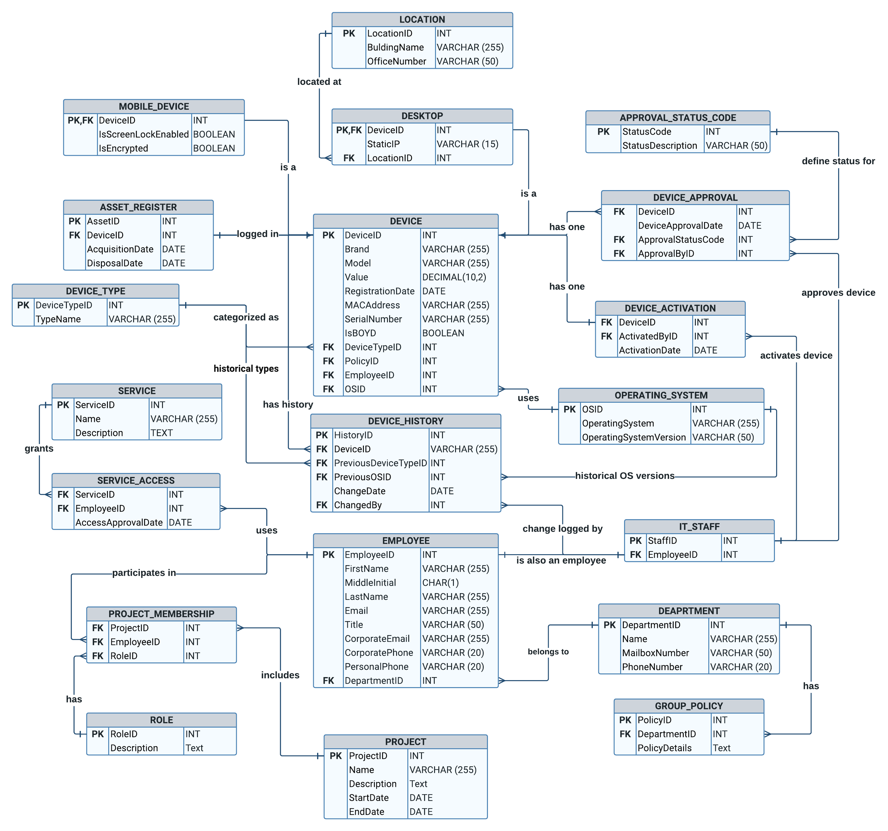
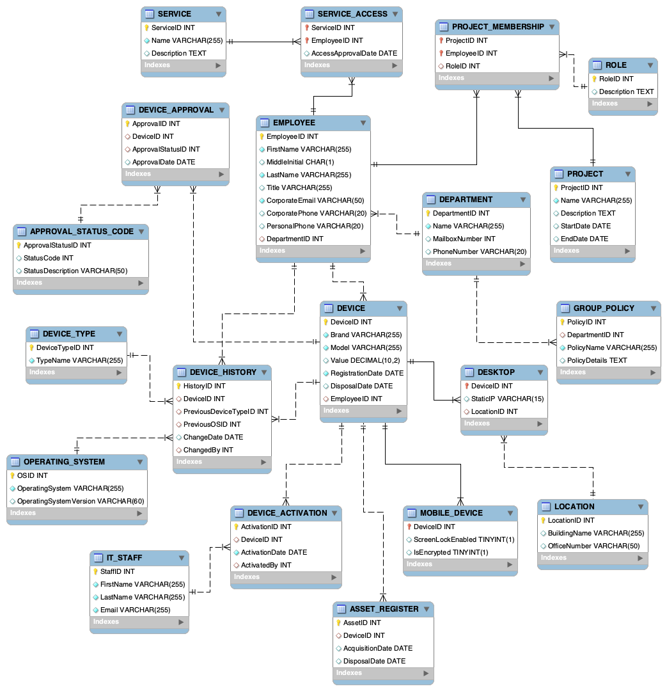

# LiBOYD System MySQL Project

## Background

Life Insurance Co. decided to introduce a "bring your device" (BYOD) model as part of their post-COVID "Work from Home" policy. Employees can use personal devices such as laptops, tablets, and smartphones to connect to the company network. The IT department aims to ensure cybersecurity compliance for all devices. The following are the business rules and requirements for the LiBOYD system.

- **Departments:** Employees work for specific departments, each having a unique code, name, mailbox number, and phone number.
- **Projects:** New projects are created to address business issues. Each project has a name, description, start and end dates.
- **Devices:** Devices can be desktops or mobile devices. Each device must be registered and approved before connecting to the network.
- **Employee Access:** Employees must get permission to access special services, which are tracked by the system.

The business rules & full requirements can be seen at [LiBOYD System Requirements](./LiBOYD_system_requirements.md)

### Business Rules

The system ensures that:
- Only registered and approved devices can connect to the network.
- Each device must comply with the IT department's cybersecurity policies.
- Devices are activated only after meeting all security requirements.

## Project Approach

### Step 1: Creating the ERD Diagram

The first step was to identify the key entities and their attributes based on the project requirements. This was documented in the data definition file, which includes detailed data definitions for each entity.

### Step 2: Designing the Database Schema

Using the identified entities and attributes, an Entity-Relationship Diagram (ERD) was created. The ERD provides a visual representation of the database schema, showing how different entities are related to each other.



### Step 3: Implementing the Database in MySQL

With the ERD as a blueprint, the next step was to implement the database schema in MySQL. This involved creating tables for each entity and defining their relationships.

Path: [Database Creation Script](./SQL_Scripts/LiBoyd_create_script.sql)

#### Example Snippet:
```sql
CREATE TABLE `EMPLOYEE` (
  `EmployeeID` INT PRIMARY KEY,
  `FirstName` VARCHAR(255) NOT NULL,
  `MiddleInitial` CHAR(1),
  `LastName` VARCHAR(255) NOT NULL,
  `Title` VARCHAR(255),
  `CorporateEmail` VARCHAR(50) NOT NULL,
  `CorporatePhone` VARCHAR(20),
  `PersonalPhone` VARCHAR(20),
  `DepartmentID` INT,
  FOREIGN KEY (`DepartmentID`) REFERENCES `DEPARTMENT`(`DepartmentID`)
);

CREATE TABLE `DEPARTMENT` (
  `DepartmentID` INT PRIMARY KEY,
  `Name` VARCHAR(255) NOT NULL,
  `MailboxNumber` INT,
  `PhoneNumber` VARCHAR(20)
);
```

### Step 3: Inserting Data

Mock data was inserted into the tables to demonstrate the system's functionality. This data serves as sample records to test and validate the database operations.

Path: [Database Insertion Script](./SQL_Scripts/LiBoyd_insert_script.sql)

#### Example Snippet:
```sql
INSERT INTO `EMPLOYEE` (`EmployeeID`, `FirstName`, `MiddleInitial`, `LastName`, `Title`, `CorporateEmail`, `CorporatePhone`, `PersonalPhone`, `DepartmentID`) VALUES
(1, 'John', 'A', 'Doe', 'Mr.', 'john.doe@lifeinsuranceco.com', '555-1234', '555-5678', 1),
(2, 'Jane', 'B', 'Smith', 'Ms.', 'jane.smith@lifeinsuranceco.com', '555-8765', '555-4321', 2);

INSERT INTO `DEPARTMENT` (`DepartmentID`, `Name`, `MailboxNumber`, `PhoneNumber`) VALUES
(1, 'Sales and Marketing', 101, '555-1010'),
(2, 'Compliance and Legal', 102, '555-2020');

```

The dataset can be seen here: [Datasets and Tables](./SQL_scripts/datasets_and_tables.md)

### Step 4: Verifying the Database Schema
After creating the database schema in MySQL, the schema was reverse-engineered to generate an Entity-Relationship Model (ERM). This step verified that the ERD and ERM models match, ensuring the correct database creation.



### Step 5: Writing SQL Queries for IT Management
The IT management team is interested in important analytics to help them understand and manage the BYOD implementation effectively. Below listed questions were posed, and SQL queries were written to answer these questions.

- Provide a breakdown of the number of BYOD devices by type, make, model, and operating system.
- What is the total cost of all BYODs in use and a cost breakdown of types and models?
- What us the average cost of each type of BOYD device?
- What are the average times between registration and approval, approval to activation and the average time from registration to device?
- What type of device and operating system took the longest in days to be activated?
- What are the minimum and maximum times for service delivery to activation?

Path: [Database Insertion Script](./SQL_Scripts/LiBoyd_answer_script.sql)

#### 1. Breakdown of BYOD devices by type, make model, and operating system.

This helps IT management understand the diversity and distribution of devices within the company.

```sql
SELECT 
    DT.TypeName AS DeviceType, 
    D.Brand, 
    D.Model, 
    OS.OperatingSystem, 
    COUNT(*) AS DeviceCount
FROM 
    DEVICE D
JOIN 
    DEVICE_TYPE DT ON D.DeviceTypeID = DT.DeviceTypeID
JOIN 
    OPERATING_SYSTEM OS ON D.OSID = OS.OSID
GROUP BY 
    DT.TypeName, D.Brand, D.Model, OS.OperatingSystem;

```

| TypeName   | Brand   | Model       | TotalValue |
|------------|---------|-------------|------------|
| Smartphone | Apple   | iPhone 12   | 800.00     |
| Tablet     | Samsung | Galaxy S21  | 700.00     |
| Laptop     | Google  | Pixel 5     | 650.00     |
| Desktop    | Apple   | MacBook Pro | 1500.00    |
| Server     | Dell    | XPS 13      | 1200.00    |


#### 2. Total cost of all BYODs and cost breakdown by types and models.

This provides insight into the financial investment in BYODs and helps in budgeting and cost management.

```sql
SELECT 
    DT.TypeName AS DeviceType, 
    D.Brand, 
    D.Model, 
    SUM(D.Value) AS TotalCost
FROM 
    DEVICE D
JOIN 
    DEVICE_TYPE DT ON D.DeviceTypeID = DT.DeviceTypeID
GROUP BY 
    DT.TypeName, D.Brand, D.Model;
```
| TotalCostOfAllBYODs |
|---------------------|
| 7380.00             |

#### 3. The average cost of each type of BYOD device.

Understanding the average cost helps in evaluating the cost-effectiveness of different types of devices.
```sql
SELECT 
    DT.TypeName AS DeviceType, 
    AVG(D.Value) AS AverageCost
FROM 
    DEVICE D
JOIN 
    DEVICE_TYPE DT ON D.DeviceTypeID = DT.DeviceTypeID
GROUP BY 
    DT.TypeName;

```

| TypeName   | AverageCost |
|------------|-------------|
| Smartphone | 800.000000  |
| Tablet     | 700.000000  |
| Laptop     | 650.000000  |
| Desktop    | 1500.000000 |
| Server     | 1200.000000 |

#### 4. Average times between registration and approval, approval to activation, and registration to activation.

This helps in assessing the efficiency of the device approval and activation processes.

```sql
SELECT 
    AVG(DATEDIFF(A.ApprovalDate, D.RegistrationDate)) AS AvgRegistrationToApproval,
    AVG(DATEDIFF(AC.ActivationDate, A.ApprovalDate)) AS AvgApprovalToActivation,
    AVG(DATEDIFF(AC.ActivationDate, D.RegistrationDate)) AS AvgRegistrationToActivation
FROM 
    DEVICE D
JOIN 
    DEVICE_APPROVAL A ON D.DeviceID = A.DeviceID
JOIN 
    DEVICE_ACTIVATION AC ON D.DeviceID = AC.DeviceID;

```

| AvgTimeBetweenRegistrationAndApproval | AvgTimeBetweenApprovalAndActivation | AvgTimeFromRegistrationToActivation |
|---------------------------------------|-------------------------------------|-------------------------------------|
| 10.0000                               | 5.0000                              | 15.0000                             |

#### 5. The device and operating system that took the longest to be activated.

Identifying delays in the activation process can help in optimizing procedures and addressing bottlenecks.

```sql
SELECT 
    D.DeviceID, 
    OS.OperatingSystem, 
    MAX(DATEDIFF(AC.ActivationDate, D.RegistrationDate)) AS MaxActivationTime
FROM 
    DEVICE D
JOIN 
    OPERATING_SYSTEM OS ON D.OSID = OS.OSID
JOIN 
    DEVICE_ACTIVATION AC ON D.DeviceID = AC.DeviceID
GROUP BY 
    D.DeviceID, OS.OperatingSystem
ORDER BY 
    MaxActivationTime DESC
LIMIT 1;

```


| TypeName   | OperatingSystem | MaxDaysToActivation |
|------------|-----------------|---------------------|
| Smartphone | iOS             | 15                  |


#### 6. Minimum and maximum times for service delivery to activation.

Understanding the range of activation times can help set realistic expectations and improve service delivery.

```sql
SELECT 
    MIN(DATEDIFF(AC.ActivationDate, D.RegistrationDate)) AS MinServiceDeliveryTime,
    MAX(DATEDIFF(AC.ActivationDate, D.RegistrationDate)) AS MaxServiceDeliveryTime
FROM 
    DEVICE D
JOIN 
    DEVICE_ACTIVATION AC ON D.DeviceID = AC.DeviceID;

```

| MinTimeServiceToActivation | MaxTimeServiceToActivation |
|----------------------------|----------------------------|
| 10                         | 10                         |


### Data Definitions and Normalization
Path: [Data Definitions and Normalization](./Data_Definitions_and_Normalization.md)

This document provides detailed data definitions for all entities and explains how the database design adheres to the principles of normalization.

### Conclusion
This project aims to design and implement a comprehensive system for managing BYOD devices within Life Insurance Co. By following the structured approach of defining the schema, creating the database, and inserting mock data, the project demonstrates how to manage and analyze BYOD devices effectively. The SQL queries provide valuable insights and analytics for IT management, ensuring that all devices comply with cybersecurity policies and are efficiently managed.

For any further information or questions, please refer to the detailed documentation and scripts included in this repository.

